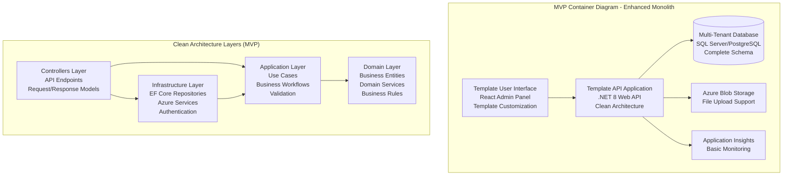
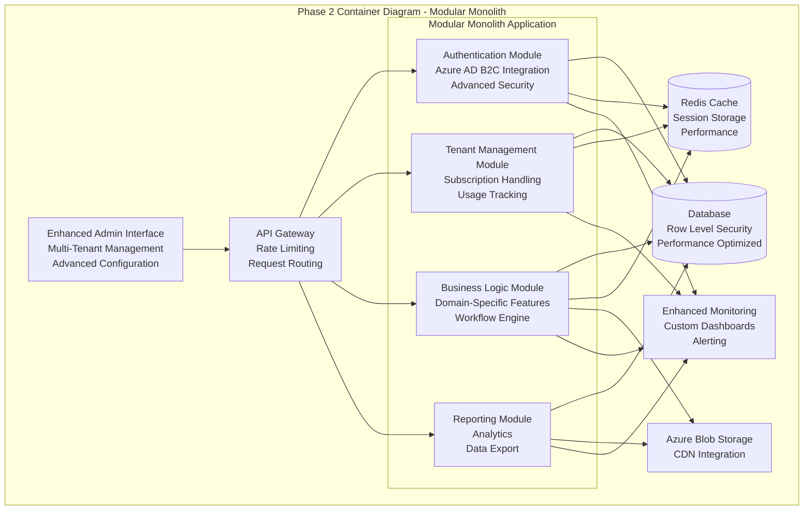

# Ract.AI Template SimpleBackend - Complete MVP-to-Enterprise Evolution Plan

## Executive Summary

### Business Problem & Solution
**Problem**: Development teams repeatedly build custom backend applications from scratch, leading to inconsistent architecture, duplicated effort, and extended time-to-market for business applications.

**Solution**: A comprehensive .NET backend template with built-in MVP-to-enterprise evolution strategy, providing reusable business application foundation with clean architecture, multi-tenant capabilities, and zero-migration scaling path.

### MVP Value Proposition (6-8 Weeks)
- **Core Value**: Production-ready .NET backend template with Clean Architecture that scales from MVP to enterprise without architectural rewrites
- **Business Impact**: Reduce new project startup time from 4-8 weeks to 2-3 days
- **Technical Foundation**: Multi-tenant database schema, authentication, CRUD operations, and Azure deployment ready
- **Differentiation**: Zero-migration evolution path with additive-only database changes and interface-based provider switching

### Success Metrics
- **Week 8**: Template generates working multi-tenant backend with authentication and basic CRUD
- **Month 3**: Template adopted for 2+ real business projects
- **Month 6**: Template supports enterprise features (advanced caching, monitoring, compliance)
- **Month 12**: Template becomes standard foundation for all new business applications

## 1. MVP Scope & Features (6-8 Week Delivery)

### Core Business Features

#### Feature 1: Multi-Tenant Foundation
**Business Description**: Template supports multiple isolated customer environments from day one, enabling SaaS business models
**Technical Description**: Database schema with tenant isolation, tenant context injection throughout application layers
**Value Delivered**: Eliminates need for costly multi-tenant refactoring as business scales

#### Feature 2: Complete Authentication & Authorization System
**Business Description**: Production-ready user management with role-based permissions and secure token handling
**Technical Description**: JWT authentication with role-based authorization, user management APIs, password reset flows
**Value Delivered**: Security compliance from MVP, no authentication rewrites needed

#### Feature 3: Generic CRUD Operations Framework
**Business Description**: Developers can quickly add new business entities without writing boilerplate code
**Technical Description**: Generic repository pattern with Entity Framework, auto-generated API endpoints, validation framework
**Value Delivered**: 80% faster feature development for standard business operations

#### Feature 4: Azure-Ready Deployment Pipeline
**Business Description**: One-click deployment to Azure with proper monitoring and scaling configuration
**Technical Description**: ARM templates, App Service deployment, Application Insights integration, automated CI/CD
**Value Delivered**: Production deployment in hours instead of weeks

#### Feature 5: Enterprise Architecture Foundation
**Business Description**: Clean, maintainable codebase that supports long-term evolution and team collaboration
**Technical Description**: Onion Architecture with proper dependency injection, domain-driven design patterns
**Value Delivered**: Technical debt prevention, easier onboarding of new developers

### User Workflows Included
- **Template User**: Download template → Customize for business domain → Deploy to Azure → Add business features
- **End User**: Register account → Authenticate → Perform CRUD operations → Access multi-tenant data
- **Administrator**: Manage users → Configure tenant settings → Monitor application health

### Features Explicitly Excluded from MVP
- **Advanced Caching (Redis)**: Postponed to Phase 2 - MVP uses IMemoryCache with interface for easy provider switching
- **Advanced Monitoring & Alerting**: Postponed to Phase 2 - MVP includes basic Application Insights
- **Microservices Architecture**: Postponed to Phase 3 - MVP is Enhanced Monolith with modular preparation
- **Advanced Security Compliance**: Postponed to Phase 3 - MVP includes basic security, enterprise compliance added later
- **Performance Optimization**: Postponed to Phase 2 - MVP focused on functionality, optimization in next phase

## 2. Complete Database Design

### End-State Data Model
```sql
-- Multi-tenant foundation with complete business entity support
-- Designed for additive-only evolution (no migrations required)

-- Core tenant and user management
CREATE TABLE Tenants (
    Id UNIQUEIDENTIFIER PRIMARY KEY DEFAULT NEWID(),
    Name NVARCHAR(255) NOT NULL,
    Subdomain NVARCHAR(100) NOT NULL UNIQUE,
    CreatedAt DATETIME2 NOT NULL DEFAULT GETUTCDATE(),
    ModifiedAt DATETIME2 NOT NULL DEFAULT GETUTCDATE(),
    IsActive BIT NOT NULL DEFAULT 1,
    -- Phase 2 columns (added in schema but unused in MVP)
    SubscriptionTier NVARCHAR(50) NULL,
    MaxUsers INT NULL,
    CustomSettings NVARCHAR(MAX) NULL, -- JSON configuration
    -- Phase 3 columns (added in schema but unused until Phase 3)
    ComplianceLevel NVARCHAR(50) NULL,
    DataRetentionDays INT NULL,
    EncryptionKeyId NVARCHAR(255) NULL
);

CREATE TABLE Users (
    Id UNIQUEIDENTIFIER PRIMARY KEY DEFAULT NEWID(),
    TenantId UNIQUEIDENTIFIER NOT NULL,
    Email NVARCHAR(255) NOT NULL,
    PasswordHash NVARCHAR(255) NOT NULL,
    FirstName NVARCHAR(100) NOT NULL,
    LastName NVARCHAR(100) NOT NULL,
    CreatedAt DATETIME2 NOT NULL DEFAULT GETUTCDATE(),
    ModifiedAt DATETIME2 NOT NULL DEFAULT GETUTCDATE(),
    IsActive BIT NOT NULL DEFAULT 1,
    LastLoginAt DATETIME2 NULL,
    -- Phase 2 columns (added in schema but unused in MVP)
    ProfileImageUrl NVARCHAR(500) NULL,
    TimeZone NVARCHAR(50) NULL,
    Preferences NVARCHAR(MAX) NULL, -- JSON preferences
    -- Phase 3 columns (added in schema but unused until Phase 3)
    MfaEnabled BIT NULL DEFAULT 0,
    MfaSecret NVARCHAR(255) NULL,
    ComplianceAgreementVersion NVARCHAR(10) NULL,
    
    FOREIGN KEY (TenantId) REFERENCES Tenants(Id),
    UNIQUE (TenantId, Email)
);

CREATE TABLE Roles (
    Id UNIQUEIDENTIFIER PRIMARY KEY DEFAULT NEWID(),
    TenantId UNIQUEIDENTIFIER NOT NULL,
    Name NVARCHAR(100) NOT NULL,
    Description NVARCHAR(500) NULL,
    CreatedAt DATETIME2 NOT NULL DEFAULT GETUTCDATE(),
    -- Phase 2 columns (added in schema but unused in MVP)
    IsSystemRole BIT NULL DEFAULT 0,
    CustomPermissions NVARCHAR(MAX) NULL, -- JSON permissions
    
    FOREIGN KEY (TenantId) REFERENCES Tenants(Id),
    UNIQUE (TenantId, Name)
);

CREATE TABLE UserRoles (
    Id UNIQUEIDENTIFIER PRIMARY KEY DEFAULT NEWID(),
    UserId UNIQUEIDENTIFIER NOT NULL,
    RoleId UNIQUEIDENTIFIER NOT NULL,
    AssignedAt DATETIME2 NOT NULL DEFAULT GETUTCDATE(),
    AssignedBy UNIQUEIDENTIFIER NULL,
    -- Phase 3 columns (added in schema but unused until Phase 3)
    ExpiresAt DATETIME2 NULL,
    
    FOREIGN KEY (UserId) REFERENCES Users(Id) ON DELETE CASCADE,
    FOREIGN KEY (RoleId) REFERENCES Roles(Id) ON DELETE CASCADE,
    FOREIGN KEY (AssignedBy) REFERENCES Users(Id),
    UNIQUE (UserId, RoleId)
);

-- Generic business entity framework (used by template customization)
CREATE TABLE EntityTypes (
    Id UNIQUEIDENTIFIER PRIMARY KEY DEFAULT NEWID(),
    TenantId UNIQUEIDENTIFIER NOT NULL,
    Name NVARCHAR(100) NOT NULL,
    DisplayName NVARCHAR(255) NOT NULL,
    TableName NVARCHAR(100) NOT NULL,
    CreatedAt DATETIME2 NOT NULL DEFAULT GETUTCDATE(),
    -- Phase 2 columns (added in schema but unused in MVP)
    IsAudited BIT NULL DEFAULT 0,
    ValidationRules NVARCHAR(MAX) NULL, -- JSON validation rules
    -- Phase 3 columns (added in schema but unused until Phase 3)
    DataClassification NVARCHAR(50) NULL,
    RetentionPolicy NVARCHAR(MAX) NULL, -- JSON retention rules
    
    FOREIGN KEY (TenantId) REFERENCES Tenants(Id),
    UNIQUE (TenantId, Name),
    UNIQUE (TenantId, TableName)
);

-- Example business entity (customizable by template users)
CREATE TABLE BusinessEntities (
    Id UNIQUEIDENTIFIER PRIMARY KEY DEFAULT NEWID(),
    TenantId UNIQUEIDENTIFIER NOT NULL,
    EntityTypeId UNIQUEIDENTIFIER NOT NULL,
    Name NVARCHAR(255) NOT NULL,
    Description NVARCHAR(MAX) NULL,
    Status NVARCHAR(50) NOT NULL DEFAULT 'Active',
    CreatedAt DATETIME2 NOT NULL DEFAULT GETUTCDATE(),
    CreatedBy UNIQUEIDENTIFIER NOT NULL,
    ModifiedAt DATETIME2 NOT NULL DEFAULT GETUTCDATE(),
    ModifiedBy UNIQUEIDENTIFIER NOT NULL,
    -- Phase 2 columns (added in schema but unused in MVP)
    Tags NVARCHAR(MAX) NULL, -- JSON array of tags
    CustomData NVARCHAR(MAX) NULL, -- JSON custom fields
    Version INT NULL DEFAULT 1,
    -- Phase 3 columns (added in schema but unused until Phase 3)
    IsArchived BIT NULL DEFAULT 0,
    ArchivedAt DATETIME2 NULL,
    ArchivedBy UNIQUEIDENTIFIER NULL,
    
    FOREIGN KEY (TenantId) REFERENCES Tenants(Id),
    FOREIGN KEY (EntityTypeId) REFERENCES EntityTypes(Id),
    FOREIGN KEY (CreatedBy) REFERENCES Users(Id),
    FOREIGN KEY (ModifiedBy) REFERENCES Users(Id),
    FOREIGN KEY (ArchivedBy) REFERENCES Users(Id)
);

-- Audit log for compliance (Phase 3 feature, schema added early)
CREATE TABLE AuditLogs (
    Id UNIQUEIDENTIFIER PRIMARY KEY DEFAULT NEWID(),
    TenantId UNIQUEIDENTIFIER NOT NULL,
    UserId UNIQUEIDENTIFIER NULL,
    EntityType NVARCHAR(100) NOT NULL,
    EntityId UNIQUEIDENTIFIER NOT NULL,
    Action NVARCHAR(50) NOT NULL, -- Create, Update, Delete, View
    OldValues NVARCHAR(MAX) NULL, -- JSON
    NewValues NVARCHAR(MAX) NULL, -- JSON
    Timestamp DATETIME2 NOT NULL DEFAULT GETUTCDATE(),
    IpAddress NVARCHAR(45) NULL,
    UserAgent NVARCHAR(500) NULL,
    -- Phase 3 columns (added in schema but unused until Phase 3)
    ComplianceRequired BIT NULL DEFAULT 0,
    RetentionExpiresAt DATETIME2 NULL,
    
    FOREIGN KEY (TenantId) REFERENCES Tenants(Id),
    FOREIGN KEY (UserId) REFERENCES Users(Id)
);

-- Indexes for performance (designed for multi-tenant queries)
CREATE INDEX IX_Users_TenantId_Email ON Users(TenantId, Email);
CREATE INDEX IX_BusinessEntities_TenantId_Status ON BusinessEntities(TenantId, Status);
CREATE INDEX IX_BusinessEntities_TenantId_EntityTypeId ON BusinessEntities(TenantId, EntityTypeId);
CREATE INDEX IX_AuditLogs_TenantId_Timestamp ON AuditLogs(TenantId, Timestamp DESC);
CREATE INDEX IX_AuditLogs_EntityType_EntityId ON AuditLogs(EntityType, EntityId);

-- Row Level Security for multi-tenant isolation (Phase 2 feature)
-- Schema includes RLS preparation but policies added in Phase 2
```

### MVP Database Implementation
- **Tables Used Immediately**: Tenants, Users, Roles, UserRoles, EntityTypes, BusinessEntities (basic columns only)
- **Columns Initially Unused**: All Phase 2 and Phase 3 columns exist but are NULL/default values
- **Evolution Strategy**: New functionality uses existing NULL columns, no ALTER TABLE statements required
- **Performance**: Indexes designed for multi-tenant access patterns from day one

### Data Migration Strategy
- **No Hard Migrations**: All evolution phases use existing schema with additive data population
- **Rollback Capability**: New features can be disabled by reverting to ignore new columns
- **Zero Downtime**: Schema evolution happens through application logic changes only
- **Validation**: Each phase includes data validation to ensure schema assumptions are met

## 3. Architecture Evolution Strategy

### MVP Architecture (Enhanced Monolith - Weeks 1-8)


**MVP Capabilities**:
- Multi-tenant data isolation
- JWT authentication with role-based authorization
- Generic CRUD operations for any business entity
- File upload and management
- Basic monitoring and logging
- Azure App Service deployment ready

### Transitional Architecture (Modular Monolith - Months 2-6)


**Transitional Capabilities**:
- Module-based organization with clear boundaries
- Advanced caching with Redis
- Enhanced monitoring and alerting
- Azure AD B2C integration
- Performance optimizations
- Advanced tenant management

### End State Architecture (Enterprise Modular Monolith - Months 7-12)
```mermaid
graph TB
    subgraph "Enterprise Container Diagram - Advanced Modular Monolith"
        PORTAL[Enterprise Portal<br/>Multi-Brand Support<br/>White-Label UI]
        CDN[Azure CDN<br/>Global Distribution<br/>Static Asset Caching]
        
        subgraph "API Layer"
            APIGW[Azure API Management<br/>Enterprise Gateway<br/>Policy Enforcement]
            GRAPHQL[GraphQL Gateway<br/>Unified Data Access<br/>Real-time Subscriptions]
        end
        
        subgraph "Enterprise Application Modules"
            AUTH[Identity & Access Module<br/>SSO Integration<br/>Compliance Audit]
            TENANT[Enterprise Tenant Module<br/>Multi-Region Support<br/>Data Sovereignty]
            CORE[Core Business Module<br/>Advanced Workflows<br/>Event Sourcing]
            ANALYTICS[Analytics Module<br/>ML/AI Integration<br/>Predictive Features]
            INTEGRATION[Integration Module<br/>External API Management<br/>Event Bus]
            COMPLIANCE[Compliance Module<br/>GDPR/SOX Support<br/>Data Governance]
        end
        
        subgraph "Data Layer"
            PRIMARYDB[(Primary Database<br/>Read-Write Master<br/>Multi-Region)]
            READDB[(Read Replicas<br/>Query Performance<br/>Regional Distribution)]
            TIMEDB[(Time Series DB<br/>Analytics Data<br/>Performance Metrics)]
        end
        
        subgraph "Enterprise Services"
            REDIS[(Redis Cluster<br/>Distributed Caching<br/>Session Management)]
            SERVICEBUS[Azure Service Bus<br/>Enterprise Messaging<br/>Event Distribution]
            KEYVAULT[Azure Key Vault<br/>Secret Management<br/>Encryption Keys)]
            SEARCH[Azure Cognitive Search<br/>Full-Text Search<br/>AI-Powered)]
        end
        
        PORTAL --> CDN
        CDN --> APIGW
        APIGW --> GRAPHQL
        
        GRAPHQL --> AUTH
        GRAPHQL --> TENANT
        GRAPHQL --> CORE
        GRAPHQL --> ANALYTICS
        GRAPHQL --> INTEGRATION
        GRAPHQL --> COMPLIANCE
        
        AUTH --> PRIMARYDB
        TENANT --> PRIMARYDB
        CORE --> PRIMARYDB
        ANALYTICS --> READDB
        ANALYTICS --> TIMEDB
        INTEGRATION --> PRIMARYDB
        COMPLIANCE --> PRIMARYDB
        
        AUTH --> REDIS
        TENANT --> REDIS
        CORE --> REDIS
        ANALYTICS --> REDIS
        
        CORE --> SERVICEBUS
        INTEGRATION --> SERVICEBUS
        COMPLIANCE --> SERVICEBUS
        
        AUTH --> KEYVAULT
        TENANT --> KEYVAULT
        COMPLIANCE --> KEYVAULT
        
        ANALYTICS --> SEARCH
        CORE --> SEARCH
    end
```

**Enterprise Capabilities**:
- Multi-region deployment with data sovereignty
- Advanced compliance and governance
- ML/AI integration for predictive features
- Event-driven architecture with enterprise messaging
- Advanced security with SSO and audit trails
- White-label and multi-brand support

### Architecture Decision Rationale

**Enhanced Monolith Foundation**:
- **Cost-Benefit**: 70% lower operational complexity than microservices for MVP scale
- **Team Capability**: Matches AI implementation strengths (single codebase, unified patterns)
- **Evolution Support**: Clean architecture enables modular extraction when scale demands it

**Modular Evolution Strategy**:
- **Business Value Gate**: Modules created only when tenant count > 50 or revenue > $50k/month
- **Technical Debt Prevention**: Module boundaries defined early, enforced through architecture tests
- **Risk Mitigation**: Each module can be extracted to separate service if needed

**Technology Consistency**:
- **Zero Migration Path**: All technology choices support provider switching through interfaces
- **Cost Optimization**: Each phase optimizes for actual usage patterns (cache, database, monitoring)
- **Enterprise Readiness**: Foundation supports compliance, security, and scale requirements

## 4. Technology Stack Integration Plan

### Core Technologies

#### Backend: .NET 8 LTS
**Rationale**: 
- Long-term support through 2026, providing stability for enterprise adoption
- Native cloud integration with Azure services
- Superior performance for business application workloads
- Strong typing and enterprise development patterns

**Evolution Support**:
- Minimal APIs for MVP, full controllers for enterprise features
- Built-in dependency injection supports clean architecture
- Entity Framework Core enables database evolution without migrations
- ASP.NET Core supports both monolithic and distributed deployment

#### Database: SQL Server / PostgreSQL
**Rationale**:
- SQL Server: Native Azure integration, excellent .NET tooling, enterprise features
- PostgreSQL: Cost-effective alternative, JSON support, open source flexibility
- Both support row-level security for multi-tenant isolation
- Strong consistency guarantees for business applications

**Evolution Support**:
- **MVP**: Single database with multi-tenant schema
- **Transitional**: Read replicas and performance optimization
- **Enterprise**: Multi-region with data sovereignty compliance

#### Frontend: React with TypeScript
**Rationale**:
- Template admin interface for configuration and management
- Component library for consistent UI across template customizations
- TypeScript ensures type safety with .NET API integration
- Strong ecosystem for enterprise UI requirements

**Evolution Support**:
- **MVP**: Basic admin panel for template configuration
- **Transitional**: Advanced multi-tenant management interface
- **Enterprise**: White-label portal with custom branding

### Azure Services Integration

#### Hosting: Azure App Service → Container Apps
**Evolution Path**:
- **MVP**: App Service ($/month: $73)
  - Integrated deployment from GitHub
  - Built-in SSL and custom domains
  - Auto-scaling for variable loads
- **Transitional**: App Service with additional instances ($256/month)
- **Enterprise**: Container Apps with microservice support ($450+/month)

#### Database: Azure SQL Database → Multi-Region Setup
**Evolution Path**:
- **MVP**: Azure SQL Database Basic ($5/month)
- **Transitional**: Standard tier with read replicas ($124/month)
- **Enterprise**: Premium with geo-replication ($831+/month)

#### Authentication: JWT → Azure AD B2C → Enterprise SSO
**Evolution Path**:
- **MVP**: Custom JWT implementation (included)
- **Transitional**: Azure AD B2C integration ($0-18/month)
- **Enterprise**: Enterprise SSO with compliance ($50+/month)

#### Caching: IMemoryCache → Redis → Redis Cluster
**Evolution Path**:
- **MVP**: In-memory caching (no additional cost)
- **Transitional**: Azure Cache for Redis ($73/month)
- **Enterprise**: Redis Cluster with high availability ($300+/month)

#### Monitoring: Application Insights → Advanced Analytics
**Evolution Path**:
- **MVP**: Basic Application Insights ($23/month)
- **Transitional**: Custom dashboards and alerting ($89/month)
- **Enterprise**: Advanced analytics with ML integration ($200+/month)

### Development and Deployment Pipeline

#### Version Control and CI/CD
- **Repository**: GitHub with branch protection rules
- **CI/CD**: GitHub Actions with Azure deployment
- **Package Management**: NuGet for .NET dependencies, npm for frontend
- **Code Quality**: SonarQube integration, automated security scanning

#### Testing Strategy
- **Unit Testing**: xUnit with high coverage requirements (>90%)
- **Integration Testing**: TestContainers for database testing
- **End-to-End Testing**: Playwright for UI automation
- **Performance Testing**: NBomber for load testing

#### Documentation and Standards
- **API Documentation**: Swagger/OpenAPI with detailed examples
- **Architecture Documentation**: Living documentation with C4 diagrams
- **Code Standards**: EditorConfig, StyleCop, ESLint enforcement
- **Security Standards**: OWASP compliance, automated vulnerability scanning

## 5. Enterprise Architecture Standards Compliance

### Clean Architecture Implementation
```
┌─────────────────────────────────────────────────────────────┐
│                     Presentation Layer                      │
│  ┌─────────────────┐  ┌────────────────┐  ┌─────────────── │
│  │   Controllers   │  │   ViewModels   │  │   API Models   │
│  └─────────────────┘  └────────────────┘  └─────────────── │
└─────────────────────────────────────────────────────────────┘
                                │
┌─────────────────────────────────────────────────────────────┐
│                    Infrastructure Layer                     │
│  ┌─────────────────┐  ┌────────────────┐  ┌─────────────── │
│  │  Repositories   │  │  External APIs │  │  Azure Services│
│  └─────────────────┘  └────────────────┘  └─────────────── │
└─────────────────────────────────────────────────────────────┘
                                │
┌─────────────────────────────────────────────────────────────┐
│                     Application Layer                       │
│  ┌─────────────────┐  ┌────────────────┐  ┌─────────────── │
│  │   Use Cases     │  │   Services     │  │   Validators   │
│  └─────────────────┘  └────────────────┘  └─────────────── │
└─────────────────────────────────────────────────────────────┘
                                │
┌─────────────────────────────────────────────────────────────┐
│                       Domain Layer                          │
│  ┌─────────────────┐  ┌────────────────┐  ┌─────────────── │
│  │    Entities     │  │  Domain Events │  │ Business Rules │
│  └─────────────────┘  └────────────────┘  └─────────────── │
└─────────────────────────────────────────────────────────────┘
```

**Layer Responsibilities**:
- **Presentation**: HTTP concerns, request/response mapping, authentication
- **Infrastructure**: Data access, external service integration, Azure services
- **Application**: Business workflow orchestration, validation, use case implementation
- **Domain**: Core business logic, entities, domain events, business rules

### Domain-Driven Design Patterns

#### Bounded Contexts
```
┌────────────────────────────────────────────────────────────┐
│                    Identity & Access Context               │
│  ┌─────────────────┐  ┌────────────────┐  ┌─────────────  │
│  │     Users       │  │     Roles      │  │ Permissions   │
│  └─────────────────┘  └────────────────┘  └─────────────  │
└────────────────────────────────────────────────────────────┘

┌────────────────────────────────────────────────────────────┐
│                    Tenant Management Context               │
│  ┌─────────────────┐  ┌────────────────┐  ┌─────────────  │
│  │    Tenants      │  │  Subscriptions │  │ Configuration │
│  └─────────────────┘  └────────────────┘  └─────────────  │
└────────────────────────────────────────────────────────────┘

┌────────────────────────────────────────────────────────────┐
│                    Business Logic Context                  │
│  ┌─────────────────┐  ┌────────────────┐  ┌─────────────  │
│  │    Entities     │  │   Workflows    │  │   Reporting   │
│  └─────────────────┘  └────────────────┘  └─────────────  │
└────────────────────────────────────────────────────────────┘
```

#### Aggregate Design
- **User Aggregate**: User entity with roles, maintains consistency of user permissions
- **Tenant Aggregate**: Tenant entity with configuration, ensures tenant isolation
- **Business Entity Aggregate**: Generic business entity with audit trail, supports any business domain

#### Domain Services
- **Multi-Tenant Isolation Service**: Ensures data access respects tenant boundaries
- **Permission Evaluation Service**: Complex business rule evaluation for access control
- **Audit Trail Service**: Cross-cutting concern for compliance and security

### SOLID Principles Implementation

#### Single Responsibility Principle
- **Controllers**: Handle HTTP requests only, delegate to application services
- **Repositories**: Data access only, no business logic
- **Use Cases**: Single business workflow, clear input/output contracts

#### Open-Closed Principle
- **Provider Pattern**: Authentication, caching, storage providers switchable through configuration
- **Strategy Pattern**: Business rule evaluation, validation rules, workflow engines
- **Extension Points**: Plugin architecture for custom business logic

#### Liskov Substitution Principle
- **Repository Interfaces**: Any implementation (EF Core, Dapper, etc.) works interchangeably
- **Service Interfaces**: Mock implementations for testing, production implementations for runtime
- **Provider Abstractions**: In-memory, Redis, SQL Server providers all interchangeable

#### Interface Segregation Principle
- **Granular Interfaces**: IUserRepository, ITenantRepository instead of IGenericRepository
- **Role-Specific Interfaces**: IReadOnlyRepository, IWriteRepository separation
- **Feature-Specific Interfaces**: IAuthenticationService, IAuthorizationService separation

#### Dependency Inversion Principle
- **Dependency Injection**: All dependencies injected through constructor
- **Abstraction Dependencies**: Controllers depend on interfaces, not concrete implementations
- **Configuration-Based**: Provider selection through configuration, not compile-time

## 6. Detailed Implementation Roadmap

### Week 1-2: Foundation & Core Infrastructure

#### Week 1: Project Setup and Architecture Foundation
**Day 1-2: Solution Architecture**
- Initialize .NET 8 solution with Clean Architecture structure
- Set up project references and dependency injection container
- Configure Entity Framework Core with multi-tenant schema
- Implement basic tenant context injection

**Deliverables**:
- Solution structure following Clean Architecture patterns
- Database schema deployed to development environment
- Basic tenant context working throughout application layers
- Unit test project structure with initial tests

**Day 3-4: Authentication Foundation**
- Implement JWT authentication with refresh tokens
- Create user registration and login endpoints
- Implement role-based authorization framework
- Set up password hashing and security measures

**Deliverables**:
- Working JWT authentication system
- User registration and login APIs
- Role-based authorization attributes
- Security configuration following best practices

**Day 5-7: Generic CRUD Framework**
- Implement generic repository pattern with Entity Framework
- Create base controller for CRUD operations
- Implement validation framework with FluentValidation
- Set up API versioning and OpenAPI documentation

**Deliverables**:
- Generic repository and unit of work patterns
- Base CRUD controller handling standard operations
- Validation framework integrated with controllers
- Swagger documentation for all APIs

#### Week 2: Core Business Logic and Integration
**Day 8-10: Business Entity Management**
- Implement tenant-aware business entity operations
- Create audit trail system for all entity changes
- Implement soft delete pattern with entity recovery
- Set up entity versioning for change tracking

**Deliverables**:
- Complete business entity CRUD with tenant isolation
- Audit trail capturing all data changes
- Soft delete implementation with recovery capabilities
- Entity versioning system working

**Day 11-12: File Management and Storage**
- Integrate Azure Blob Storage for file operations
- Implement secure file upload with virus scanning
- Create file metadata management system
- Set up file access control with tenant isolation

**Deliverables**:
- File upload and download functionality
- Secure file storage in Azure Blob Storage
- File metadata management with database integration
- Tenant-isolated file access controls

**Day 13-14: Testing and Quality Assurance**
- Complete unit test suite for core functionality
- Implement integration tests with TestContainers
- Set up code coverage reporting and quality gates
- Perform security testing and vulnerability assessment

**Deliverables**:
- >90% code coverage with comprehensive unit tests
- Integration test suite covering happy path and error scenarios
- Code quality reports with zero critical issues
- Security test results with all vulnerabilities addressed

### Week 3-4: Advanced Features and Production Readiness

#### Week 3: Advanced Features Implementation
**Day 15-17: Advanced Authentication and Authorization**
- Implement multi-factor authentication support
- Create advanced permission system with custom roles
- Set up password policy enforcement and rotation
- Implement session management with concurrent login control

**Deliverables**:
- Multi-factor authentication working with authenticator apps
- Custom role creation and permission management
- Enforced password policies with rotation requirements
- Session management preventing unauthorized concurrent access

**Day 18-19: Performance Optimization**
- Implement caching strategy with IMemoryCache
- Optimize database queries with proper indexing
- Set up API rate limiting and request throttling
- Implement pagination and filtering for large datasets

**Deliverables**:
- Caching implemented for frequently accessed data
- Database performance optimized with proper indexes
- API rate limiting protecting against abuse
- Efficient pagination and filtering for all list endpoints

**Day 20-21: Monitoring and Observability**
- Integrate Application Insights for telemetry
- Implement structured logging with Serilog
- Set up health checks for all dependencies
- Create custom dashboards for application monitoring

**Deliverables**:
- Application Insights capturing all telemetry data
- Structured logging with correlation IDs across requests
- Health check endpoints for monitoring systems
- Custom dashboards showing application health and performance

#### Week 4: Deployment and Go-Live Preparation
**Day 22-24: Azure Infrastructure Setup**
- Create ARM templates for infrastructure as code
- Set up Azure App Service with proper configuration
- Configure Azure SQL Database with security settings
- Implement backup and disaster recovery procedures

**Deliverables**:
- Complete Azure infrastructure deployed through ARM templates
- App Service configured with auto-scaling and security
- Database backup and recovery procedures tested
- Disaster recovery plan documented and validated

**Day 25-26: CI/CD Pipeline Implementation**
- Set up GitHub Actions for continuous integration
- Implement automated testing in CI pipeline
- Configure deployment slots for zero-downtime deployments
- Set up environment-specific configuration management

**Deliverables**:
- Fully automated CI/CD pipeline from commit to production
- Automated testing preventing broken code deployment
- Zero-downtime deployment process with rollback capability
- Environment configuration management with secrets handling

**Day 27-28: Go-Live and Documentation**
- Deploy to production environment with monitoring
- Complete user documentation and API guides
- Implement template customization examples
- Conduct final security and performance validation

**Deliverables**:
- Production deployment successful with monitoring active
- Complete documentation for template users
- Working examples of template customization
- Final validation reports confirming readiness

### Week 5-6: Template Packaging and Distribution

#### Week 5: Template Creation and Packaging
**Day 29-31: Template Structure Optimization**
- Create template project structure for easy customization
- Implement template parameter substitution system
- Create example implementations for common business domains
- Set up template testing framework for validation

**Deliverables**:
- Template project ready for distribution
- Parameter substitution allowing easy customization
- Example implementations (CRM, inventory, project management)
- Template validation ensuring customizations work correctly

**Day 32-33: Documentation and User Guides**
- Create comprehensive template documentation
- Write step-by-step customization guides
- Develop video tutorials for template usage
- Set up community support channels

**Deliverables**:
- Complete template documentation with examples
- User guides covering common customization scenarios
- Video tutorials showing template usage
- Support channels for template users

**Day 34-35: Distribution and Feedback Collection**
- Package template for NuGet distribution
- Create GitHub repository with issue tracking
- Implement usage analytics for improvement insights
- Set up feedback collection system

**Deliverables**:
- Template distributed through NuGet packages
- GitHub repository with proper issue templates
- Analytics tracking template usage patterns
- Feedback system collecting user experience data

#### Week 6: MVP Launch and Validation
**Day 36-38: MVP Launch Preparation**
- Final testing of all MVP features
- Performance testing under load
- Security penetration testing
- Documentation review and updates

**Deliverables**:
- All MVP features tested and validated
- Performance benchmarks meeting requirements
- Security testing passed with no critical issues
- Documentation updated and accurate

**Day 39-40: Public Launch**
- Announce template availability
- Engage with developer community
- Monitor adoption and gather feedback
- Address immediate user issues

**Deliverables**:
- Template publicly available and announced
- Community engagement and feedback collection active
- Initial adoption metrics tracked
- User issues resolved quickly

**Day 41-42: MVP Success Validation**
- Analyze usage metrics and feedback
- Validate MVP success criteria achievement
- Plan Phase 2 features based on user needs
- Document lessons learned and improvements

**Deliverables**:
- MVP success criteria validated with data
- Phase 2 roadmap updated based on user feedback
- Lessons learned documented for future phases
- Template improvement backlog prioritized

### Evolution Phases

#### Phase 2 (Months 2-6): Enhanced Enterprise Features
**Business Value Gate**: 10+ template downloads, 3+ production deployments, positive user feedback >4.0/5.0

**Month 2 Features**:
- **Redis Caching Integration**: Switch from IMemoryCache to Redis with zero code changes
- **Azure AD B2C Integration**: Enterprise authentication with SSO capabilities  
- **Advanced Monitoring**: Custom dashboards, alerting, and performance analytics
- **Row-Level Security**: Database-level multi-tenant isolation for enhanced security

**Month 3 Features**:
- **Subscription Management**: Billing integration, usage tracking, tier-based features
- **Advanced Permission System**: Fine-grained permissions, dynamic role creation
- **API Rate Limiting**: Advanced throttling, quota management, abuse prevention
- **Data Export/Import**: Bulk operations, data migration tools, backup/restore

**Month 4 Features**:
- **Workflow Engine**: Business process automation, approval workflows, task management
- **Notification System**: Email, SMS, push notifications with template management
- **Advanced Search**: Full-text search with Azure Cognitive Search integration
- **Mobile API Support**: Optimized endpoints for mobile applications

**Month 5 Features**:
- **Multi-Language Support**: Internationalization, localization, timezone handling
- **Advanced Analytics**: Business intelligence, reporting, data visualization
- **Integration Framework**: Webhook support, external API integration, event handling
- **Performance Optimization**: Query optimization, caching improvements, load testing

**Month 6 Features**:
- **Compliance Framework**: GDPR, SOX compliance, audit trail enhancements
- **Advanced Security**: Penetration testing, security hardening, vulnerability management
- **Scalability Testing**: Load testing, performance benchmarking, capacity planning
- **Enterprise Documentation**: Architecture decision records, operational runbooks

#### Phase 3 (Months 7-12): Enterprise-Grade Platform
**Business Value Gate**: 50+ template downloads, 10+ production deployments, $10k+ in related consulting revenue

**Months 7-9: Modular Architecture**
- **Module Extraction**: Extract bounded contexts into separate modules
- **Inter-Module Communication**: Event-driven communication, message queues
- **Module Deployment**: Independent module deployment, versioning strategy
- **Module Marketplace**: Third-party module integration, plugin architecture

**Months 10-12: Enterprise Platform**
- **Multi-Region Support**: Global deployment, data sovereignty, regional compliance
- **Advanced AI Integration**: Machine learning models, predictive analytics, AI-powered features
- **Enterprise Integrations**: ERP systems, CRM integration, enterprise service bus
- **White-Label Platform**: Multi-brand support, custom branding, partner portals

## 7. Risk Assessment & Mitigation Framework

### MVP Delivery Risks (6-8 Weeks)

| Risk | Impact | Probability | Mitigation Strategy |
|------|--------|-------------|-------------------|
| **Authentication Security Vulnerabilities** | High | Medium | - Implement OAuth2/JWT best practices<br/>- Third-party security review<br/>- Automated vulnerability scanning<br/>- Penetration testing |
| **Multi-Tenant Data Isolation Failures** | Critical | Low | - Row-level security implementation<br/>- Comprehensive integration testing<br/>- Tenant isolation validation framework<br/>- Database security audit |
| **Database Performance Under Load** | High | Medium | - Performance testing with realistic data<br/>- Query optimization and indexing<br/>- Caching strategy implementation<br/>- Database monitoring setup |
| **Azure Service Integration Complexity** | Medium | High | - Prototype all Azure integrations early<br/>- Fallback to local implementations<br/>- Azure expertise on team<br/>- Service-specific testing |
| **Scope Creep and Feature Bloat** | Medium | High | - Strict MVP feature definition<br/>- Change control process<br/>- Regular stakeholder communication<br/>- Time-boxed development cycles |
| **Template Customization Complexity** | High | Medium | - Extensive documentation and examples<br/>- Template validation framework<br/>- Community support channels<br/>- Video tutorials and guides |

### Evolution Phase Risks

| Risk | Phase | Impact | Mitigation Strategy |
|------|-------|--------|-------------------|
| **Redis Migration Complexity** | Phase 2 | Medium | - Interface-based caching abstraction<br/>- Gradual migration strategy<br/>- Rollback capability maintenance<br/>- Performance comparison testing |
| **Module Boundary Violations** | Phase 3 | High | - Architecture testing framework<br/>- Code review focusing on boundaries<br/>- Static analysis for dependency violations<br/>- Regular architecture reviews |
| **Performance Degradation** | All Phases | High | - Continuous performance monitoring<br/>- Performance regression testing<br/>- Capacity planning for each phase<br/>- Performance budgets and alerts |
| **Security Compliance Failures** | Phase 3 | Critical | - Compliance framework implementation<br/>- Regular security audits<br/>- Automated compliance checking<br/>- Security training for team |
| **Technology Debt Accumulation** | All Phases | Medium | - Technical debt tracking<br/>- Refactoring budget allocation<br/>- Code quality gates<br/>- Regular architecture reviews |

### Technical Debt Management

#### Monitoring Strategy
- **Code Quality Metrics**: Cyclomatic complexity, code coverage, duplication
- **Architecture Violations**: Dependency rule violations, layer boundary crossings
- **Performance Metrics**: Response time degradation, memory usage growth
- **Security Metrics**: Vulnerability count, security hotspots, compliance gaps

#### Refactoring Windows
- **Phase Transitions**: Major refactoring allowed between phases
- **Monthly Maintenance**: 20% of capacity dedicated to technical debt
- **Critical Issues**: Immediate refactoring for security or performance critical issues
- **User Impact**: No refactoring affecting user-facing features during stable periods

#### Quality Gates
- **Code Reviews**: All code reviewed by senior developers
- **Automated Testing**: >90% code coverage, all integration tests passing
- **Static Analysis**: Zero critical issues in SonarQube, security scanning clean
- **Performance**: No regression in key performance indicators

## 8. Technology Integration Deep Dive

### .NET 8 LTS Foundation

#### Core Framework Selection
```csharp
// Program.cs - Application startup with Clean Architecture DI
var builder = WebApplication.CreateBuilder(args);

// Infrastructure Layer Registration
builder.Services.AddInfrastructure(builder.Configuration);

// Application Layer Registration  
builder.Services.AddApplication();

// Domain Layer Registration
builder.Services.AddDomain();

// Presentation Layer Configuration
builder.Services.AddControllers()
    .AddJsonOptions(options =>
    {
        options.JsonSerializerOptions.PropertyNamingPolicy = JsonNamingPolicy.CamelCase;
    });

builder.Services.AddEndpointsApiExplorer();
builder.Services.AddSwaggerGen(c =>
{
    c.AddSecurityDefinition("Bearer", new OpenApiSecurityScheme
    {
        Type = SecuritySchemeType.ApiKey,
        Name = "Authorization",
        In = ParameterLocation.Header,
        Description = "JWT Authorization header using the Bearer scheme."
    });
});
```

#### Entity Framework Core Configuration
```csharp
// Infrastructure/Data/ApplicationDbContext.cs
public class ApplicationDbContext : DbContext, IApplicationDbContext
{
    private readonly ITenantProvider _tenantProvider;

    public ApplicationDbContext(
        DbContextOptions<ApplicationDbContext> options,
        ITenantProvider tenantProvider) : base(options)
    {
        _tenantProvider = tenantProvider;
    }

    // Multi-tenant query filter applied automatically
    protected override void OnModelCreating(ModelBuilder modelBuilder)
    {
        // Apply tenant isolation filter to all tenant-aware entities
        foreach (var entityType in modelBuilder.Model.GetEntityTypes())
        {
            if (typeof(ITenantAware).IsAssignableFrom(entityType.ClrType))
            {
                var parameter = Expression.Parameter(entityType.ClrType, "e");
                var tenantId = Expression.PropertyOrField(parameter, nameof(ITenantAware.TenantId));
                var currentTenant = Expression.Constant(_tenantProvider.GetTenantId());
                var filter = Expression.Equal(tenantId, currentTenant);
                var lambda = Expression.Lambda(filter, parameter);
                
                modelBuilder.Entity(entityType.ClrType).HasQueryFilter(lambda);
            }
        }

        base.OnModelCreating(modelBuilder);
    }
}
```

#### Generic Repository Pattern with Provider Switching
```csharp
// Application/Interfaces/IRepository.cs
public interface IRepository<TEntity> where TEntity : class
{
    Task<TEntity> GetByIdAsync(Guid id, CancellationToken cancellationToken = default);
    Task<IEnumerable<TEntity>> GetAllAsync(CancellationToken cancellationToken = default);
    Task<TEntity> AddAsync(TEntity entity, CancellationToken cancellationToken = default);
    Task UpdateAsync(TEntity entity, CancellationToken cancellationToken = default);
    Task DeleteAsync(Guid id, CancellationToken cancellationToken = default);
}

// Infrastructure/Repositories/EntityFrameworkRepository.cs
public class EntityFrameworkRepository<TEntity> : IRepository<TEntity> 
    where TEntity : class, IEntity
{
    private readonly ApplicationDbContext _context;
    private readonly DbSet<TEntity> _dbSet;

    public EntityFrameworkRepository(ApplicationDbContext context)
    {
        _context = context;
        _dbSet = context.Set<TEntity>();
    }

    public async Task<TEntity> GetByIdAsync(Guid id, CancellationToken cancellationToken = default)
    {
        return await _dbSet.FindAsync(new object[] { id }, cancellationToken);
    }

    // Additional methods...
}

// Alternative Dapper implementation for high-performance scenarios
public class DapperRepository<TEntity> : IRepository<TEntity> 
    where TEntity : class, IEntity
{
    private readonly IDbConnection _connection;
    
    // High-performance implementation using Dapper
}
```

### Azure Services Integration Strategy

#### Configuration-Based Provider Switching
```csharp
// appsettings.json - Environment-specific configuration
{
  "Providers": {
    "Cache": "Memory", // Phase 1: Memory, Phase 2: Redis
    "Authentication": "JWT", // Phase 1: JWT, Phase 2: AzureADB2C
    "Storage": "AzureBlob", // Consistent across all phases
    "Database": "SqlServer" // Consistent across all phases
  },
  "Azure": {
    "SqlDatabase": {
      "ConnectionString": "Server=...",
      "TenantIsolation": "RowLevelSecurity"
    },
    "BlobStorage": {
      "ConnectionString": "DefaultEndpointsProtocol=https...",
      "ContainerName": "template-files"
    },
    "Redis": {
      "ConnectionString": "template-cache.redis.cache.windows.net:6380",
      "Database": 0
    }
  }
}

// Infrastructure/Configuration/ServiceRegistration.cs
public static class ServiceCollectionExtensions
{
    public static IServiceCollection AddInfrastructure(
        this IServiceCollection services, 
        IConfiguration configuration)
    {
        // Database configuration
        services.AddDbContext<ApplicationDbContext>(options =>
        {
            var provider = configuration["Providers:Database"];
            var connectionString = configuration.GetConnectionString("DefaultConnection");
            
            switch (provider.ToLowerInvariant())
            {
                case "sqlserver":
                    options.UseSqlServer(connectionString);
                    break;
                case "postgresql":
                    options.UseNpgsql(connectionString);
                    break;
                default:
                    throw new NotSupportedException($"Database provider '{provider}' not supported");
            }
        });

        // Cache configuration with provider switching
        var cacheProvider = configuration["Providers:Cache"];
        switch (cacheProvider.ToLowerInvariant())
        {
            case "memory":
                services.AddMemoryCache();
                services.AddSingleton<ICacheService, MemoryCacheService>();
                break;
            case "redis":
                services.AddStackExchangeRedisCache(options =>
                {
                    options.Configuration = configuration["Azure:Redis:ConnectionString"];
                });
                services.AddSingleton<ICacheService, RedisCacheService>();
                break;
        }

        // Authentication configuration with provider switching
        var authProvider = configuration["Providers:Authentication"];
        switch (authProvider.ToLowerInvariant())
        {
            case "jwt":
                services.AddJwtAuthentication(configuration);
                break;
            case "azureadb2c":
                services.AddAzureADB2CAuthentication(configuration);
                break;
        }

        return services;
    }
}
```

#### Azure Blob Storage Integration
```csharp
// Infrastructure/Services/AzureBlobStorageService.cs
public class AzureBlobStorageService : IFileStorageService
{
    private readonly BlobServiceClient _blobServiceClient;
    private readonly ITenantProvider _tenantProvider;
    private readonly ILogger<AzureBlobStorageService> _logger;

    public AzureBlobStorageService(
        BlobServiceClient blobServiceClient,
        ITenantProvider tenantProvider,
        ILogger<AzureBlobStorageService> logger)
    {
        _blobServiceClient = blobServiceClient;
        _tenantProvider = tenantProvider;
        _logger = logger;
    }

    public async Task<string> UploadFileAsync(
        Stream fileStream, 
        string fileName, 
        string contentType,
        CancellationToken cancellationToken = default)
    {
        try
        {
            var tenantId = _tenantProvider.GetTenantId();
            var containerName = $"tenant-{tenantId}".ToLowerInvariant();
            
            var containerClient = _blobServiceClient.GetBlobContainerClient(containerName);
            await containerClient.CreateIfNotExistsAsync(cancellationToken: cancellationToken);
            
            var blobName = $"{Guid.NewGuid()}/{fileName}";
            var blobClient = containerClient.GetBlobClient(blobName);
            
            await blobClient.UploadAsync(
                fileStream, 
                new BlobHttpHeaders { ContentType = contentType },
                cancellationToken: cancellationToken);
                
            _logger.LogInformation("File uploaded successfully: {BlobName}", blobName);
            return blobClient.Uri.ToString();
        }
        catch (Exception ex)
        {
            _logger.LogError(ex, "Error uploading file: {FileName}", fileName);
            throw;
        }
    }
}
```

### Performance Optimization Strategy

#### Caching Implementation with Provider Switching
```csharp
// Application/Interfaces/ICacheService.cs
public interface ICacheService
{
    Task<T> GetAsync<T>(string key, CancellationToken cancellationToken = default) where T : class;
    Task SetAsync<T>(string key, T value, TimeSpan expiration, CancellationToken cancellationToken = default) where T : class;
    Task RemoveAsync(string key, CancellationToken cancellationToken = default);
    Task<T> GetOrSetAsync<T>(string key, Func<Task<T>> getItem, TimeSpan expiration, CancellationToken cancellationToken = default) where T : class;
}

// Infrastructure/Services/MemoryCacheService.cs (MVP Implementation)
public class MemoryCacheService : ICacheService
{
    private readonly IMemoryCache _memoryCache;
    private readonly ITenantProvider _tenantProvider;

    public async Task<T> GetAsync<T>(string key, CancellationToken cancellationToken = default) where T : class
    {
        var tenantKey = GetTenantKey(key);
        return _memoryCache.Get<T>(tenantKey);
    }

    public async Task SetAsync<T>(string key, T value, TimeSpan expiration, CancellationToken cancellationToken = default) where T : class
    {
        var tenantKey = GetTenantKey(key);
        _memoryCache.Set(tenantKey, value, expiration);
    }

    private string GetTenantKey(string key)
    {
        var tenantId = _tenantProvider.GetTenantId();
        return $"tenant_{tenantId}_{key}";
    }
}

// Infrastructure/Services/RedisCacheService.cs (Phase 2 Implementation)
public class RedisCacheService : ICacheService
{
    private readonly IDistributedCache _distributedCache;
    private readonly ITenantProvider _tenantProvider;
    private readonly JsonSerializerOptions _jsonOptions;

    public async Task<T> GetAsync<T>(string key, CancellationToken cancellationToken = default) where T : class
    {
        var tenantKey = GetTenantKey(key);
        var cachedValue = await _distributedCache.GetStringAsync(tenantKey, cancellationToken);
        
        return cachedValue == null 
            ? null 
            : JsonSerializer.Deserialize<T>(cachedValue, _jsonOptions);
    }

    public async Task SetAsync<T>(string key, T value, TimeSpan expiration, CancellationToken cancellationToken = default) where T : class
    {
        var tenantKey = GetTenantKey(key);
        var serializedValue = JsonSerializer.Serialize(value, _jsonOptions);
        
        await _distributedCache.SetStringAsync(
            tenantKey, 
            serializedValue, 
            new DistributedCacheEntryOptions { SlidingExpiration = expiration },
            cancellationToken);
    }
}
```

#### Database Performance Optimization
```sql
-- Performance-optimized indexes for multi-tenant scenarios
-- Primary indexes for tenant isolation
CREATE INDEX IX_Users_TenantId_Active ON Users(TenantId, IsActive) 
WHERE IsActive = 1;

CREATE INDEX IX_BusinessEntities_TenantId_Status_Modified ON BusinessEntities(TenantId, Status, ModifiedAt DESC)
INCLUDE (Id, Name, CreatedBy);

-- Composite indexes for common query patterns
CREATE INDEX IX_BusinessEntities_TenantId_EntityType_Name ON BusinessEntities(TenantId, EntityTypeId, Name)
WHERE IsActive = 1;

-- Audit log performance (write-heavy, time-based queries)
CREATE CLUSTERED INDEX IX_AuditLogs_Timestamp_TenantId ON AuditLogs(Timestamp DESC, TenantId);
CREATE INDEX IX_AuditLogs_EntityId_EntityType ON AuditLogs(EntityId, EntityType, TenantId);

-- Row Level Security policies for automated tenant isolation
CREATE SECURITY POLICY TenantIsolationPolicy
ADD FILTER PREDICATE dbo.fn_TenantAccessPredicate(TenantId) ON dbo.Users,
ADD FILTER PREDICATE dbo.fn_TenantAccessPredicate(TenantId) ON dbo.BusinessEntities,
ADD BLOCK PREDICATE dbo.fn_TenantAccessPredicate(TenantId) ON dbo.Users AFTER INSERT,
ADD BLOCK PREDICATE dbo.fn_TenantAccessPredicate(TenantId) ON dbo.BusinessEntities AFTER INSERT
WITH (STATE = ON);
```

## 9. Success Criteria & Validation Framework

### MVP Success Criteria (Week 8)

#### Core Functionality Validation
- [ ] **Multi-Tenant Isolation**: Automated tests confirm complete data isolation between tenants
- [ ] **Authentication Security**: Penetration testing shows no critical vulnerabilities in auth system
- [ ] **CRUD Operations**: All business entity operations work correctly with proper validation
- [ ] **Azure Deployment**: Template deploys to Azure App Service with zero manual configuration
- [ ] **Performance Baseline**: API responses <2 seconds for 95th percentile under normal load

#### Business Value Metrics
- [ ] **Template Download Time**: Complete template setup in <30 minutes for experienced developer
- [ ] **Customization Effort**: Add new business entity with full CRUD in <4 hours
- [ ] **Documentation Quality**: New developer can deploy and customize without external help
- [ ] **Production Readiness**: Template passes security scan and performance test for production use
- [ ] **User Satisfaction**: Initial user feedback >4.0/5.0 rating for template usability

#### Technical Quality Standards
- [ ] **Code Coverage**: >90% unit test coverage across all layers
- [ ] **Architecture Compliance**: Zero violations of Clean Architecture dependency rules
- [ ] **Security Standards**: OWASP Top 10 vulnerabilities addressed with automated scanning
- [ ] **Performance Standards**: Database queries optimized, caching implemented, monitoring active
- [ ] **Documentation Coverage**: All public APIs documented, architecture decisions recorded

### Evolution Phase Success Criteria

#### Phase 2 Success Criteria (Month 6)
**Business Value Gate**: 25+ template downloads, 5+ production deployments, 3+ case studies

- [ ] **Redis Migration**: Zero downtime migration from memory cache to Redis
- [ ] **Azure AD B2C**: Enterprise authentication working with major identity providers
- [ ] **Advanced Monitoring**: Custom dashboards, alerting system, performance analytics
- [ ] **Subscription Management**: Billing integration, usage tracking, tier-based features
- [ ] **Performance Improvement**: 50% faster response times through caching and optimization

#### Phase 3 Success Criteria (Month 12)
**Business Value Gate**: 100+ template downloads, 20+ production deployments, $50k+ revenue impact

- [ ] **Modular Architecture**: Clear module boundaries with independent deployment capability
- [ ] **Enterprise Compliance**: GDPR, SOX compliance framework with audit capabilities
- [ ] **Multi-Region Support**: Template deploys globally with data sovereignty compliance
- [ ] **AI Integration**: Machine learning features providing business value
- [ ] **Platform Ecosystem**: Third-party modules available, partner integrations working

### Validation Testing Framework

#### Automated Testing Strategy
```csharp
// Tests/Integration/MultiTenantIsolationTests.cs
[Collection("Database")]
public class MultiTenantIsolationTests : IClassFixture<WebApplicationFactory<Program>>
{
    private readonly WebApplicationFactory<Program> _factory;
    private readonly HttpClient _client;

    [Fact]
    public async Task Should_Isolate_Tenant_Data_Completely()
    {
        // Arrange
        var tenant1Token = await GetTenantAuthToken("tenant1@example.com");
        var tenant2Token = await GetTenantAuthToken("tenant2@example.com");
        
        // Create entity for tenant 1
        var tenant1Entity = await CreateBusinessEntity(tenant1Token, "Tenant 1 Entity");
        
        // Act - Try to access tenant 1 entity with tenant 2 credentials
        _client.DefaultRequestHeaders.Authorization = new AuthenticationHeaderValue("Bearer", tenant2Token);
        var response = await _client.GetAsync($"/api/entities/{tenant1Entity.Id}");
        
        // Assert
        Assert.Equal(HttpStatusCode.NotFound, response.StatusCode);
    }

    [Fact]
    public async Task Should_Handle_Concurrent_Multi_Tenant_Operations()
    {
        // Test concurrent operations across multiple tenants
        var tasks = new List<Task>();
        
        for (int i = 0; i < 10; i++)
        {
            var tenantId = $"tenant{i}";
            tasks.Add(SimulateTenantActivity(tenantId));
        }
        
        await Task.WhenAll(tasks);
        
        // Verify no data leakage between tenants
        await ValidateTenantIsolation();
    }
}

// Tests/Performance/LoadTests.cs
[Collection("Performance")]
public class LoadTests
{
    [Fact]
    public async Task Should_Handle_1000_Concurrent_Users()
    {
        var scenario = Scenario.Create("api_load_test", async context =>
        {
            var response = await httpClient.GetAsync("/api/entities");
            return response.IsSuccessStatusCode ? Response.Ok() : Response.Fail();
        })
        .WithLoadSimulations(
            Simulation.InjectPerSec(rate: 100, during: TimeSpan.FromMinutes(5))
        );

        NBomberRunner
            .RegisterScenarios(scenario)
            .Run();
    }
}
```

#### Security Testing Integration
```csharp
// Tests/Security/SecurityTests.cs
[Collection("Security")]
public class SecurityTests
{
    [Fact]
    public async Task Should_Prevent_SQL_Injection_Attacks()
    {
        var maliciousInputs = new[]
        {
            "'; DROP TABLE Users; --",
            "1' OR '1'='1",
            "admin'/*",
            "<script>alert('xss')</script>"
        };

        foreach (var input in maliciousInputs)
        {
            var response = await _client.PostAsync("/api/entities", CreateJsonContent(new
            {
                Name = input,
                Description = input
            }));

            // Should either reject input or sanitize it properly
            Assert.True(response.IsSuccessStatusCode || response.StatusCode == HttpStatusCode.BadRequest);
        }
    }

    [Fact]
    public async Task Should_Enforce_Rate_Limiting()
    {
        // Rapid-fire requests to test rate limiting
        var tasks = Enumerable.Range(0, 100)
            .Select(_ => _client.GetAsync("/api/entities"))
            .ToArray();

        var responses = await Task.WhenAll(tasks);
        var tooManyRequests = responses.Count(r => r.StatusCode == HttpStatusCode.TooManyRequests);
        
        Assert.True(tooManyRequests > 0, "Rate limiting should block excessive requests");
    }
}
```

### Business Value Measurement

#### Template Adoption Metrics
- **Download Rate**: Weekly downloads from NuGet/GitHub
- **Deployment Success**: Percentage of downloads resulting in successful deployments
- **Time to Value**: Average time from download to first successful deployment
- **Customization Usage**: Features most commonly customized by users
- **Support Requests**: Volume and type of support requests indicating pain points

#### Developer Productivity Impact
- **Setup Time Reduction**: Before/after comparison of project setup time
- **Feature Development Speed**: Time to implement common business features
- **Code Quality Metrics**: Technical debt, bug rates in template-based projects
- **Team Onboarding**: Time for new developers to become productive with template
- **Maintenance Overhead**: Time spent on infrastructure vs business logic

#### Business ROI Analysis
- **Development Cost Savings**: Reduced time-to-market for new projects
- **Consulting Revenue**: Revenue from template customization services
- **Platform Adoption**: Number of projects standardizing on template
- **Quality Improvements**: Reduced bugs, security issues in template-based projects
- **Scalability Benefits**: Cost savings from proper architecture from day one

## 10. Template Usage and Customization Guide

### Quick Start for Template Users

#### Installation and Setup
```bash
# Install the template from NuGet
dotnet new install RactAI.Template.SimpleBackend

# Create new project from template
dotnet new ract-backend -n MyBusinessApp -o ./MyBusinessApp

# Navigate to project directory
cd MyBusinessApp

# Restore dependencies
dotnet restore

# Set up database (development)
dotnet ef database update

# Run the application
dotnet run
```

#### Basic Customization Example
```csharp
// Domain/Entities/Customer.cs - Add your business entity
public class Customer : BusinessEntity
{
    public string CompanyName { get; set; }
    public string ContactEmail { get; set; }
    public string Phone { get; set; }
    public CustomerType Type { get; set; }
    public decimal CreditLimit { get; set; }
    
    // Business rules can be added here
    public bool IsEligibleForCredit(decimal amount)
    {
        return IsActive && amount <= CreditLimit;
    }
}

public enum CustomerType
{
    Individual,
    Business,
    Enterprise
}

// Infrastructure/Data/Configurations/CustomerConfiguration.cs
public class CustomerConfiguration : IEntityTypeConfiguration<Customer>
{
    public void Configure(EntityTypeBuilder<Customer> builder)
    {
        builder.HasBaseType<BusinessEntity>();
        
        builder.Property(c => c.CompanyName)
            .IsRequired()
            .HasMaxLength(255);
            
        builder.Property(c => c.ContactEmail)
            .IsRequired()
            .HasMaxLength(255);
            
        builder.HasIndex(c => new { c.TenantId, c.ContactEmail })
            .IsUnique();
    }
}

// Application/Services/CustomerService.cs
public class CustomerService : ICustomerService
{
    private readonly IRepository<Customer> _customerRepository;
    private readonly ILogger<CustomerService> _logger;

    public CustomerService(
        IRepository<Customer> customerRepository,
        ILogger<CustomerService> logger)
    {
        _customerRepository = customerRepository;
        _logger = logger;
    }

    public async Task<Customer> CreateCustomerAsync(CreateCustomerRequest request)
    {
        // Business logic specific to customers
        var customer = new Customer
        {
            CompanyName = request.CompanyName,
            ContactEmail = request.ContactEmail,
            Phone = request.Phone,
            Type = request.Type,
            CreditLimit = CalculateInitialCreditLimit(request.Type)
        };

        await _customerRepository.AddAsync(customer);
        
        _logger.LogInformation("Customer created: {CompanyName}", customer.CompanyName);
        
        return customer;
    }

    private decimal CalculateInitialCreditLimit(CustomerType type)
    {
        return type switch
        {
            CustomerType.Individual => 1000m,
            CustomerType.Business => 10000m,
            CustomerType.Enterprise => 100000m,
            _ => 0m
        };
    }
}

// Presentation/Controllers/CustomersController.cs
[ApiController]
[Route("api/[controller]")]
[Authorize]
public class CustomersController : ControllerBase
{
    private readonly ICustomerService _customerService;

    public CustomersController(ICustomerService customerService)
    {
        _customerService = customerService;
    }

    [HttpPost]
    public async Task<ActionResult<Customer>> CreateCustomer(CreateCustomerRequest request)
    {
        var customer = await _customerService.CreateCustomerAsync(request);
        return CreatedAtAction(nameof(GetCustomer), new { id = customer.Id }, customer);
    }

    [HttpGet("{id}")]
    public async Task<ActionResult<Customer>> GetCustomer(Guid id)
    {
        var customer = await _customerService.GetCustomerAsync(id);
        return customer == null ? NotFound() : Ok(customer);
    }
}
```

### Common Business Domain Examples

#### CRM Application Template
```bash
# Generate CRM-specific template
dotnet new ract-backend -n MyCRM -o ./MyCRM --domain crm

# Includes pre-configured entities:
# - Customers, Contacts, Opportunities, Activities
# - Sales pipeline management
# - Communication tracking
```

#### Inventory Management Template
```bash
# Generate inventory-specific template
dotnet new ract-backend -n MyInventory -o ./MyInventory --domain inventory

# Includes pre-configured entities:
# - Products, Categories, Suppliers, Warehouses
# - Stock tracking and management
# - Purchase order workflows
```

#### Project Management Template
```bash
# Generate project management template
dotnet new ract-backend -n MyPM -o ./MyPM --domain project-management

# Includes pre-configured entities:
# - Projects, Tasks, Teams, Timesheets
# - Workflow management
# - Resource allocation
```

### Advanced Customization Patterns

#### Custom Authentication Provider
```csharp
// Infrastructure/Authentication/CustomAuthenticationHandler.cs
public class CustomAuthenticationHandler : AuthenticationHandler<AuthenticationSchemeOptions>
{
    public CustomAuthenticationHandler(
        IOptionsMonitor<AuthenticationSchemeOptions> options,
        ILoggerFactory logger,
        UrlEncoder encoder,
        ISystemClock clock) : base(options, logger, encoder, clock)
    {
    }

    protected override async Task<AuthenticateResult> HandleAuthenticateAsync()
    {
        // Implement custom authentication logic
        // Integrate with existing identity providers
        // Return authentication result
    }
}

// Register in Program.cs
builder.Services.AddAuthentication("Custom")
    .AddScheme<AuthenticationSchemeOptions, CustomAuthenticationHandler>("Custom", options => { });
```

#### Custom Business Rules Engine
```csharp
// Domain/Rules/IBusinessRuleEngine.cs
public interface IBusinessRuleEngine
{
    Task<ValidationResult> ValidateAsync<T>(T entity, string context) where T : class;
    Task ExecuteRulesAsync<T>(T entity, string context) where T : class;
}

// Domain/Rules/CustomerBusinessRules.cs
public class CustomerBusinessRules : IBusinessRules<Customer>
{
    public async Task<ValidationResult> ValidateAsync(Customer customer, string context)
    {
        var result = new ValidationResult();
        
        if (context == "Create" || context == "Update")
        {
            if (customer.CreditLimit < 0)
                result.AddError("Credit limit cannot be negative");
                
            if (customer.Type == CustomerType.Enterprise && customer.CreditLimit < 10000)
                result.AddError("Enterprise customers must have minimum $10,000 credit limit");
        }
        
        return result;
    }
}
```

#### Multi-Language Support Integration
```csharp
// Infrastructure/Localization/DatabaseLocalizationProvider.cs
public class DatabaseLocalizationProvider : IStringLocalizer
{
    private readonly IRepository<LocalizationResource> _repository;
    private readonly ITenantProvider _tenantProvider;

    public LocalizedString this[string name]
    {
        get
        {
            var value = GetString(name);
            return new LocalizedString(name, value ?? name, resourceNotFound: value == null);
        }
    }

    private string GetString(string name)
    {
        var tenantId = _tenantProvider.GetTenantId();
        var culture = CultureInfo.CurrentCulture.Name;
        
        // Retrieve localized string from database
        // Fallback to default culture if not found
        return _repository.GetLocalizationAsync(tenantId, name, culture).Result?.Value;
    }
}

// Usage in controllers and services
public class CustomersController : ControllerBase
{
    private readonly IStringLocalizer<CustomersController> _localizer;

    public async Task<ActionResult> CreateCustomer(CreateCustomerRequest request)
    {
        // Use localized messages
        var successMessage = _localizer["Customer created successfully"];
        return Ok(new { Message = successMessage.Value });
    }
}
```

### Deployment Customization

#### Environment-Specific Configuration
```json
// appsettings.Production.json
{
  "ConnectionStrings": {
    "DefaultConnection": "Server=#{AZURE_SQL_SERVER}#;Database=#{DATABASE_NAME}#;..."
  },
  "Azure": {
    "BlobStorage": {
      "ConnectionString": "#{AZURE_STORAGE_CONNECTION}#"
    },
    "ApplicationInsights": {
      "InstrumentationKey": "#{APPINSIGHTS_KEY}#"
    }
  },
  "Providers": {
    "Cache": "Redis",
    "Authentication": "AzureADB2C",
    "Storage": "AzureBlob"
  },
  "Features": {
    "EnableAdvancedCaching": true,
    "EnableAuditLogging": true,
    "EnablePerformanceMonitoring": true
  }
}
```

#### Custom ARM Templates
```json
// Infrastructure/ARM/customized-infrastructure.json
{
    "$schema": "https://schema.management.azure.com/schemas/2019-04-01/deploymentTemplate.json#",
    "contentVersion": "1.0.0.0",
    "parameters": {
        "appName": {
            "type": "string",
            "metadata": {
                "description": "Name of the application"
            }
        },
        "environment": {
            "type": "string",
            "allowedValues": ["Development", "Staging", "Production"],
            "defaultValue": "Development"
        }
    },
    "resources": [
        {
            "type": "Microsoft.Web/sites",
            "apiVersion": "2021-02-01",
            "name": "[parameters('appName')]",
            "location": "[resourceGroup().location]",
            "properties": {
                "serverFarmId": "[resourceId('Microsoft.Web/serverfarms', variables('hostingPlanName'))]",
                "siteConfig": {
                    "netFrameworkVersion": "v8.0",
                    "appSettings": [
                        {
                            "name": "ENVIRONMENT",
                            "value": "[parameters('environment')]"
                        }
                    ]
                }
            }
        }
    ]
}
```

### Template Maintenance and Updates

#### Version Management Strategy
- **Semantic Versioning**: Major.Minor.Patch versioning for template releases
- **Breaking Changes**: Major version increments for breaking changes
- **Feature Additions**: Minor version increments for new features
- **Bug Fixes**: Patch version increments for bug fixes and security updates

#### Update Notification System
```csharp
// Services/TemplateUpdateService.cs
public class TemplateUpdateService : ITemplateUpdateService
{
    public async Task<TemplateUpdateInfo> CheckForUpdatesAsync()
    {
        var currentVersion = GetCurrentTemplateVersion();
        var latestVersion = await GetLatestVersionFromRepositoryAsync();
        
        if (latestVersion > currentVersion)
        {
            return new TemplateUpdateInfo
            {
                CurrentVersion = currentVersion,
                LatestVersion = latestVersion,
                UpdateAvailable = true,
                ChangeLog = await GetChangeLogAsync(currentVersion, latestVersion),
                BreakingChanges = await GetBreakingChangesAsync(currentVersion, latestVersion)
            };
        }
        
        return new TemplateUpdateInfo { UpdateAvailable = false };
    }
}
```

This comprehensive documentation provides the complete roadmap for implementing the .NET backend template with MVP-to-enterprise evolution strategy. The template is designed to reduce development time, ensure consistent architecture, and provide a clear scaling path for business applications.

The key differentiators of this approach are:
1. **Zero-migration evolution**: Technology choices support provider switching without code changes
2. **Database-first design**: Complete schema designed upfront with additive-only changes
3. **Clean architecture foundation**: Enterprise patterns from day one
4. **Multi-tenant ready**: Built for SaaS business models from MVP
5. **Azure-native**: Optimized for Azure services with cost-effective scaling

This documentation serves as both a technical implementation guide and a business case for adopting the template approach to backend development.