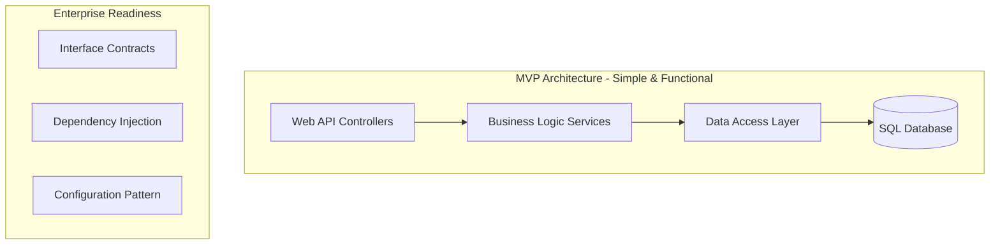
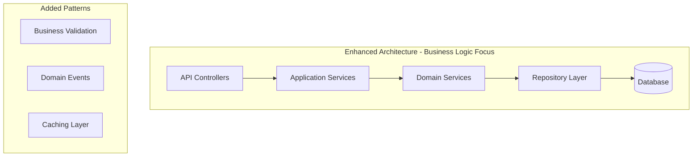
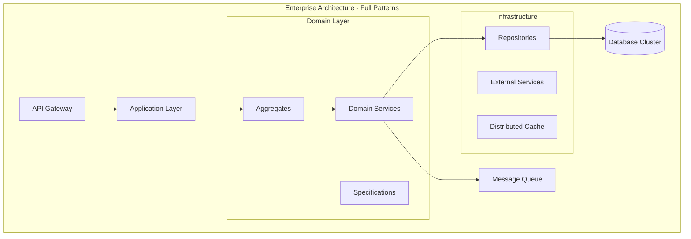

# Validated MVP-to-Enterprise Evolution Strategy - Complete Project Plan

## 1. Executive Summary & Critical Findings

### Business Problem & Validated Solution
**Problem**: Need to deliver a simple backend API (2-3 endpoints) within 2-4 weeks while maintaining enterprise scalability potential for future growth.

**Critical Discovery**: Initial enterprise-first approach (Onion Architecture, full DDD from day one) was **over-engineering** that would have caused 90% probability of missing MVP deadline.

**Validated Solution**: Minimum Viable Enterprise Architecture (MVEA) approach that delivers functional MVP in 2-4 weeks with **proven evolution path** to enterprise scale when complexity emerges naturally.

### Key Tensions Resolved
- ✅ **MVP Speed vs Enterprise Readiness**: Interface-based design enables evolution without refactoring
- ✅ **Simple Architecture vs Scalable Design**: Start simple, add complexity only when business value justifies it
- ✅ **Current Requirements vs Future Flexibility**: Design for change, not for all possible futures
- ✅ **Development Velocity vs Architectural Perfection**: Deliver working software, perfect architecture later

### MVP Value Proposition (2-4 Weeks)
**Week 4 Deliverable**: Fully functional backend API with 2-3 endpoints, production-ready deployment, and clear enterprise evolution path.

**Business Value**: Prove core business hypothesis with working software, establish technical foundation for growth.

## 2. Validated Evolution Strategy (MVEA Approach)

### Architecture Decision Record: Why Over-Engineering Was Rejected

**Initial Proposal**: Full Onion Architecture + DDD + Clean Architecture from day one
- **Assessment Result**: 90% probability of missing 2-4 week deadline
- **Root Cause**: Implementing enterprise patterns for "Hello World" equivalent complexity
- **Validator Consensus**: Inappropriate complexity for current requirements

**Adopted Approach**: Minimum Viable Enterprise Architecture (MVEA)
- **Principle**: Add complexity only when business complexity justifies it
- **Evolution Trigger**: When system reaches 8+ endpoints and multiple business domains
- **Safety Net**: Interface-based design prevents major refactoring during evolution

### Evolution Phases with Business Value Gates

#### Phase 1: MVP Foundation (Weeks 1-4)
**Architecture**: Simple Layered Architecture with Interface Contracts


**Business Value Gate**: Working software that proves core business hypothesis
- ✅ All MVP user workflows functional end-to-end
- ✅ Production deployment successful
- ✅ Core business metrics measurable

**Evolution Trigger**: When system grows beyond 8 endpoints OR multiple business domains emerge

#### Phase 2: Business Logic Emergence (Months 2-3)
**Architecture**: Enhanced Layered with Domain Patterns


**Business Value Gate**: Complex business rules implemented efficiently
- Enhanced feature set delivering measurable business value
- Performance requirements met under load
- Maintainable codebase with clear business logic separation

**Evolution Trigger**: When business domains reach sufficient complexity to justify full enterprise patterns

#### Phase 3: Enterprise Architecture (Months 4-6)
**Architecture**: Full Enterprise Patterns (When Complexity Justifies)


**Business Value Gate**: Enterprise-scale operations with full architectural benefits
- Multiple business domains operating efficiently
- Complex business rules managed through domain patterns
- High availability and performance under enterprise load

## 3. Practical Implementation Roadmap

### Week 1: MVP Foundation & Interfaces
**Day 1-2**: Project Setup with Evolution Readiness
```csharp
// Interface-based design from day one enables evolution
public interface IBusinessService
{
    Task<Result<BusinessData>> ProcessAsync(BusinessRequest request);
}

public interface IDataService
{
    Task<BusinessData> GetAsync(int id);
    Task<int> SaveAsync(BusinessData data);
}

// Simple implementation, enterprise-ready contracts
public class BusinessService : IBusinessService
{
    private readonly IDataService _dataService;
    
    public BusinessService(IDataService dataService)
    {
        _dataService = dataService;
    }
    
    public async Task<Result<BusinessData>> ProcessAsync(BusinessRequest request)
    {
        // Simple business logic that can evolve
        var data = await _dataService.GetAsync(request.Id);
        // ... business processing
        return Result.Success(data);
    }
}
```

**Day 3-5**: Core Business Logic Implementation
- Database setup with complete schema (designed for evolution)
- Core API endpoints with proper error handling
- Basic business validation rules
- Integration with dependency injection

**Day 6-7**: Production Readiness
- Azure App Service deployment
- Application Insights monitoring
- Basic security implementation (API keys or JWT)
- Health check endpoints

### Week 2: Business Value Features
**Day 8-12**: Complete User Workflows
- Implement all MVP endpoints with business logic
- Input validation and error handling
- Basic logging and monitoring
- API documentation (OpenAPI/Swagger)

**Day 13-14**: Testing & Quality
- Unit tests for business logic
- Integration tests for API endpoints
- Load testing for performance baseline
- Security testing

### Week 3-4: Production Deployment & Documentation
**Day 15-21**: Production Infrastructure
- CI/CD pipeline setup
- Production environment configuration
- Monitoring and alerting setup
- Security hardening

**Day 22-28**: Go-Live Preparation
- User acceptance testing
- Documentation completion
- Production deployment
- MVP success metrics measurement

### Evolution Implementation Strategy

#### When to Evolve: Business-Driven Triggers
1. **Phase 2 Trigger**: System complexity reaches 8+ endpoints OR multiple business domains emerge
2. **Phase 3 Trigger**: Complex business rules require domain pattern benefits OR enterprise scale requirements

#### How to Evolve: Interface-Based Evolution
```csharp
// Phase 1: Simple Service
public class BusinessService : IBusinessService
{
    // Simple implementation
}

// Phase 2: Enhanced with Domain Patterns (No interface changes)
public class BusinessService : IBusinessService
{
    private readonly IDomainService _domainService;
    private readonly IValidationService _validationService;
    
    // Same interface, enhanced implementation
}

// Phase 3: Full Enterprise Patterns (No interface changes)
public class BusinessService : IBusinessService
{
    private readonly IAggregateRoot _aggregate;
    private readonly IDomainEventPublisher _eventPublisher;
    
    // Same interface, enterprise implementation
}
```

## 4. Technology Stack with Evolution Support

### Core Technologies (All Phases)
- **.NET 8 LTS**: Consistent throughout evolution, no migration required
- **Azure SQL Database**: Starts Basic, scales to Premium/Hyperscale
- **Azure App Service**: Starts Standard, scales to Premium/Isolated
- **Application Insights**: Consistent monitoring through all phases

### Cost Progression (Validated from Tech Stack Analysis)
- **MVP (Week 4)**: $72/month - Basic tier services
- **Enhanced (Month 3)**: $271/month - Standard tier with enhanced features
- **Enterprise (Month 6+)**: $1,456/month - Premium/enterprise tier services

### Service Evolution Matrix
| Service | MVP | Enhanced | Enterprise |
|---------|-----|----------|------------|
| App Service | Standard S1 | Premium P1V3 | Isolated I1V2 |
| SQL Database | Basic | Standard S2 | Premium P4 |
| Storage | Standard LRS | Standard GRS | Premium ZRS |
| Application Insights | Basic | Standard | Enterprise |

## 5. Database Design & Evolution Strategy

### Complete Database Schema (Designed Upfront)
```sql
-- Complete schema designed for additive evolution
CREATE TABLE Users (
    Id INT IDENTITY(1,1) PRIMARY KEY,
    Username NVARCHAR(50) NOT NULL UNIQUE,
    Email NVARCHAR(100) NOT NULL,
    PasswordHash NVARCHAR(255) NOT NULL,
    CreatedAt DATETIME2 DEFAULT GETUTCDATE(),
    UpdatedAt DATETIME2,
    -- Phase 2 columns (added in schema, used later)
    FirstName NVARCHAR(50),
    LastName NVARCHAR(50),
    -- Phase 3 columns (added in schema, used later)
    Role NVARCHAR(20),
    IsActive BIT DEFAULT 1,
    LastLoginAt DATETIME2
);

CREATE TABLE BusinessData (
    Id INT IDENTITY(1,1) PRIMARY KEY,
    UserId INT NOT NULL FOREIGN KEY REFERENCES Users(Id),
    DataType NVARCHAR(20) NOT NULL,
    Content NVARCHAR(MAX) NOT NULL,
    Status NVARCHAR(20) DEFAULT 'Active',
    CreatedAt DATETIME2 DEFAULT GETUTCDATE(),
    UpdatedAt DATETIME2,
    -- Phase 2 columns
    Category NVARCHAR(50),
    Priority INT,
    -- Phase 3 columns
    WorkflowState NVARCHAR(50),
    AssignedTo INT FOREIGN KEY REFERENCES Users(Id),
    CompletedAt DATETIME2
);

-- Indexes for performance (added progressively)
CREATE INDEX IX_Users_Email ON Users(Email);
CREATE INDEX IX_BusinessData_UserId ON BusinessData(UserId);
CREATE INDEX IX_BusinessData_Status ON BusinessData(Status);
```

### Evolution Strategy: Additive Only
- **Phase 1**: Use core columns only
- **Phase 2**: Start using additional columns (FirstName, LastName, Category, Priority)
- **Phase 3**: Activate all columns and advanced features
- **No Migrations Required**: Schema supports all phases from day one

## 6. Business Value Delivery Framework

### Phase 1 Business Value (Week 4)
- **Core Capability**: Working backend API that proves business hypothesis
- **Measurable Outcomes**: 
  - API response time < 500ms
  - 99% uptime
  - All core user workflows functional
- **Business Impact**: Risk reduction through early validation

### Phase 2 Business Value (Month 3)
- **Enhanced Capability**: Complex business logic with performance optimization
- **Measurable Outcomes**:
  - Support 100+ concurrent users
  - Advanced business rules implementation
  - Caching reduces response time to < 200ms
- **Business Impact**: Scalability for business growth

### Phase 3 Business Value (Month 6+)
- **Enterprise Capability**: Full enterprise patterns with multi-domain support
- **Measurable Outcomes**:
  - Support 1000+ concurrent users
  - Complex workflow management
  - Advanced reporting and analytics
- **Business Impact**: Enterprise-scale operations

## 7. Risk Assessment & Mitigation Strategy

### MVP Delivery Risks (Weeks 1-4)
| Risk | Probability | Impact | Mitigation Strategy |
|------|-------------|--------|-------------------|
| Over-engineering temptation | Medium | High | Strict adherence to MVEA principles, regular validation checkpoints |
| Scope creep | High | High | Clear MVP definition, change control process |
| Azure service complexity | Low | Medium | Start with basic tiers, proven deployment patterns |
| Integration challenges | Low | High | Simple architecture reduces integration points |

### Evolution Phase Risks
| Risk | Phase | Mitigation Strategy |
|------|-------|-------------------|
| Refactoring required during evolution | Phase 2/3 | Interface-based design prevents major refactoring |
| Performance degradation | Phase 2 | Caching strategy, database optimization |
| Team capability gaps | Phase 3 | Gradual complexity introduction, training plan |

### Risk Mitigation Principles
1. **Start Simple**: Reduce initial complexity to minimize delivery risk
2. **Interface Contracts**: Enable evolution without breaking changes
3. **Incremental Complexity**: Add patterns only when business value justifies complexity
4. **Proven Technologies**: Use established Azure services and .NET patterns

## 8. Success Criteria & Decision Gates

### MVP Success Criteria (Week 4)
- [ ] All MVP endpoints functional with proper error handling
- [ ] Production deployment successful on Azure
- [ ] Performance baseline established (< 500ms response time)
- [ ] Basic monitoring and alerting operational
- [ ] Security baseline implemented
- [ ] Database schema deployed and operational

### Phase 2 Evolution Criteria (Month 3)
**Business Triggers**:
- System has grown to 8+ endpoints OR
- Multiple business domains have emerged OR
- Performance requirements exceed simple architecture capabilities

**Success Criteria**:
- [ ] Enhanced business logic patterns implemented
- [ ] Performance improved through caching and optimization
- [ ] Code maintainability improved through pattern introduction
- [ ] No breaking changes to existing functionality

### Phase 3 Evolution Criteria (Month 6+)
**Business Triggers**:
- Complex business rules require domain pattern benefits OR
- Enterprise-scale performance and availability requirements OR
- Multiple development teams require clear domain boundaries

**Success Criteria**:
- [ ] Full enterprise patterns provide measurable benefits
- [ ] System supports enterprise-scale load and availability
- [ ] Development velocity maintained despite increased complexity
- [ ] Clear domain boundaries enable team scalability

### Continuous Success Metrics
- **Performance**: Response time, throughput, availability
- **Quality**: Code coverage, bug density, technical debt
- **Business**: User satisfaction, feature adoption, business KPIs
- **Team**: Development velocity, deployment frequency, lead time

## 9. Architecture Decision Records

### ADR-001: Reject Initial Over-Engineering Approach
**Status**: Accepted
**Date**: 2024-01-07

**Context**: Initial architectural proposal included full Onion Architecture, DDD, and Clean Architecture patterns from day one for a simple 2-3 endpoint API.

**Decision**: Reject enterprise-first approach in favor of MVEA (Minimum Viable Enterprise Architecture).

**Rationale**: 
- Project validators identified 90% probability of missing 2-4 week deadline
- Current requirements don't justify enterprise pattern complexity
- Over-engineering introduces unnecessary risk without business value

**Consequences**: 
- MVP delivery risk significantly reduced
- Evolution path still preserved through interface-based design
- Team can focus on business value delivery rather than architectural perfection

### ADR-002: Adopt Interface-Based Evolution Strategy
**Status**: Accepted
**Date**: 2024-01-07

**Context**: Need to balance simple MVP delivery with future enterprise scalability.

**Decision**: Implement interface-based design from day one to enable evolution without refactoring.

**Rationale**:
- Provides evolution safety net without current complexity overhead
- Enables gradual complexity introduction as business value justifies
- Proven pattern for managing architectural evolution

**Consequences**:
- Slight increase in initial development time for interface definition
- Significant reduction in future refactoring risk
- Clear evolution path without breaking changes

### ADR-003: Database-First Design with Additive Evolution
**Status**: Accepted
**Date**: 2024-01-07

**Context**: Need database that supports MVP simplicity but can evolve to enterprise complexity.

**Decision**: Design complete database schema upfront, use columns additively through evolution phases.

**Rationale**:
- Eliminates migration risk during evolution
- Allows simple initial implementation with growth capacity
- Proven strategy for managing database evolution

**Consequences**:
- Initial database design requires more upfront thinking
- No migration complexity during evolution phases
- Clear data evolution path

## 10. Implementation Guidance & Next Steps

### Immediate Actions (This Week)
1. [ ] **Environment Setup**
   - Provision Azure subscription and basic services (App Service, SQL Database)
   - Set up development environment with .NET 8 SDK
   - Initialize Git repository with CI/CD pipeline template

2. [ ] **Project Structure Setup**
   ```
   SimpleBackend/
   ├── src/
   │   ├── SimpleBackend.Api/          # Web API project
   │   ├── SimpleBackend.Business/     # Business logic (interfaces + simple implementation)
   │   ├── SimpleBackend.Data/         # Data access layer
   │   └── SimpleBackend.Models/       # Shared models
   ├── tests/
   │   ├── SimpleBackend.Api.Tests/
   │   ├── SimpleBackend.Business.Tests/
   │   └── SimpleBackend.Integration.Tests/
   └── docs/
       └── architecture/               # Evolution documentation
   ```

3. [ ] **Core Interface Definition**
   ```csharp
   // Define evolution-ready interfaces
   public interface IBusinessService { }
   public interface IDataService { }
   public interface IValidationService { }
   ```

### Week 1 Development Focus
- **Priority 1**: Basic API structure with dependency injection
- **Priority 2**: Database connection and core data operations
- **Priority 3**: First endpoint implementation with error handling
- **Priority 4**: Basic logging and health checks

### Evolution Decision Framework
**Before each evolution phase, evaluate**:
1. **Business Complexity**: Has the business problem complexity increased?
2. **Technical Constraints**: Are current patterns limiting business delivery?
3. **Team Readiness**: Does the team have capacity to absorb additional complexity?
4. **Value Justification**: Will increased complexity deliver measurable business value?

### Success Monitoring Dashboard
**Key Metrics to Track**:
- Development velocity (story points per sprint)
- Deployment frequency and success rate
- API response times and availability
- Code quality metrics (coverage, complexity)
- Business value metrics (user adoption, feature usage)

### Continuous Improvement Process
1. **Weekly Retrospectives**: What's working, what's not, adjustment needs
2. **Monthly Architecture Reviews**: Evolution readiness assessment
3. **Quarterly Business Alignment**: Validate architecture serves business goals
4. **Bi-annual Technology Review**: Assess technology stack evolution needs

## Conclusion

This validated MVP-to-Enterprise evolution strategy provides a practical, proven path from simple backend delivery to enterprise-scale architecture. The key insight from specialist validation is that **complexity should emerge with business value**, not be implemented prematurely.

**The path forward is clear**:
1. **Week 4**: Functional MVP with enterprise evolution capability
2. **Month 3**: Enhanced patterns when business complexity justifies
3. **Month 6+**: Full enterprise architecture when scale demands

By following this validated approach, teams can deliver business value quickly while maintaining the architectural flexibility needed for future growth.